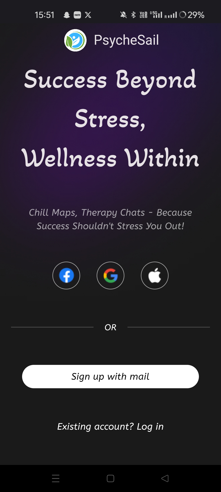

# PsycheSail

 

Introducing PsycheSail: a go-to app for emotional support and self-care for students. Chat with our helpful bot, track the progress of the user's mood, discover local activities using Google Maps, and join anonymous support/community chats with peers. Need immediate help? Connect with a counselor. Plus, access recommended books and motivational videos for extra support. Sail through tough times with PsycheSail.

Watch the product demo on:

 	
  
 

## ⚠️ Initial Survey and Problem Statement Research

<table style="width: 100%;">
  <tr>
    <td style=>
       
      
😓 
We discovered that many of our peers feel depressed and like their minds stop working when they're struggling. They're hesitant to talk about their feelings because they think they're the only ones going through tough times. This sense of loneliness and despair sometimes leads to students hurting themselves or even thinking about ending their lives.
 

       
📝 We also conducted a survey to get community response for some sought after features listed below.

    </td>
  </tr>
  <tr>
    <td style="text-align: center;">
      
    </td>
  </tr>
</table>

<!--
## 📊 Public Opinion

#### 597 students surveyed across 6️⃣ colleges in India

- The Form was circulated carefully to ensure that the intended demographic received it.
- Best efforts to ensure that only respondents who identify as female are polled.

<table style="width: 100%;">
  <tr>
    
➡️ Along with building a progressive community, we realised that we could also provide a platform to increase awarness about opportunities and scolarships. We came to this conclusion after observing that a lot of our peers were either unaware or confused by things like Google STEP Intern/Generation Scholar, TalentSprint WE, International Research Opportuntiies etc. 

    
➡️ After a classmate faced a risky situation online due to limited knowledge about digtal security, we also decided to implement a Safety Section where our users can learn about best methods to be digitally secure and also access SoS features when needed.

    <td>
      
    </td>
    <td>
      
    </td>
  </tr>
  <tr>
    <td style="text-align: center;">
      
    </td>
    <td style="text-align: center;">
      
    </td>
  </tr>
</table>

 -->

<!-- ## Latest Version - v1.0.0 -->

<table>
  <tr>
    <!-- <td>
      
    </td> -->
    <td>
      
    </td>
       <td>
      
    </td>
  </tr>
</table>

### ⭐🚀 Features

- **AI Therapist Interaction**: Experience empathetic conversations with our AI therapist, enhanced with prompt-engineered Gemini API. Each response is imbued with a human touch, integrating unique thought processes for a more genuine interaction, elevating the chatbot experience significantly.

- **Cognitive Behavioral Therapy (CBT) Techniques:** Incorporate evidence-based cognitive behavioral therapy techniques to address negative thought patterns and promote positive behavior change.

- **Recreational Activity Suggestions**: Explore nearby recreational activities and venues using the Google Maps API. Receive personalized recommendations tailored to your location and preferences, helping you discover new experiences to enhance your well-being and enjoyment.

- **Mood Tracking and Progress Visualization:** Mood analysis through NLP for personalized insights. Graphical representation of emotional progress over time.

- **Community Recommendations:** Tailored suggestions for online support groups and forums. Communities matched based on user's chat history and preferences.

- **Books Recommendation using Google Books API:** Personalized book suggestions based on user's needs. Google Books API utilized for tailored recommendations.

- **Motivational Videos Recommendations via YouTube API:** Inspiring video suggestions reflecting user's interests and struggles. Customized recommendations from YouTube API for emotional upliftment.
- **Support Groups with Anonymous Communication:** 24-hour anonymous support groups for peer connection. Vertex vector search for compatible matches in safe space.
- **Integration of Text-to-Speech (TTS) and Speech-to-Text (STT) Technology:** Voice-based interaction for accessibility and convenience. TTS and STT integration enhances user experience and engagement.
- **Notifications for Check-Ins**: Stay connected and supported with regular check-in notifications. Receive reminders to check in with your progress and well-being, ensuring you stay on track with your goals and providing an opportunity to reflect on your journey.
- **Mindfulness Exercises:** Access guided mindfulness exercises and relaxation techniques to reduce stress and improve emotional well-being.

- **Privacy and Security:** Ensure user privacy and data security with robust encryption and adherence to privacy regulations. user anonymously chat with others going through the same and hence

- **Personalized Therapy Sessions:** Access personalized therapy sessions tailored to individual needs and preferences.

- **Customizable Settings:** Customize the app settings to suit individual preferences, notifications, and therapy approach.

- **User-Friendly Interface:** Enjoy a user-friendly interface designed for easy navigation and intuitive use, enhancing the overall user experience.

- **Continuous Improvement with Gemini by Google**: PsycheSail leverages Gemini, Google's AI platform, for ongoing enhancements based on user feedback and the latest advancements in AI technology, ensuring personalized and effective therapy sessions.

<!-- ### 🪲✅ Bug Fixes

- Fixed major routing bug causing app to crash.
- Fixed render-flex errors in multiple parts of the app. -->

### 👀 Upcoming Features

- **Personalized Storytelling:** PsycheSail's Personalized Storytelling integrates challenges and victories from users' conversations with Serenity. It offers an interactive narrative journey guided by an empathetic companion, reflecting real-life experiences. Enhancements with additional graphics are planned for a more compelling user experience.

- **Achievement Badges:** Users earn badges for completing tasks or reaching milestones. Examples include completing chat sessions or practicing self-care activities. This system encourages positive engagement, fostering a sense of accomplishment.

- **Daily Challenges:** Users are offered daily challenges related to mental wellness. Challenges may include mindfulness practices or reaching out to friends for support. Completing challenges earns rewards, promoting regular engagement.

- **Storytelling and Narrative:** The app features a narrative where users improve mental well-being. Progression occurs through completing tasks and making positive changes. This narrative provides motivation and guidance for users.

- **Affiliate Marketing:** The app explores affiliate marketing to generate revenue. It partners with businesses for product promotions, earning commissions for referrals. This creates additional income streams.

- **Collaboration with Licensed Therapists:** The plan is to collaborate with therapists for professional counseling services. This expands mental health support by providing access to qualified professionals.

- **Marketing and Outreach:** The focus is on advertising and social media to raise awareness. Increasing visibility highlights PsycheSail's benefits, attracting more users.

<table style="width: 100%;">
  <tr>
    <td style="text-align: center;">
      
      
Login Screen

    </td>
    <td style="text-align: center;">
      
      
Home Screen

    </td>
    <td style="text-align: center;">
      
      
Serenity Bot

    </td>
    <td style="text-align: center;">
      
      
Stress Progress Screen

    </td>
    <td style="text-align: center;">
      
      
Motivational videos and books Screen

    </td>
  </tr>
</table>

## 🏃‍♀️ Getting Started

Download PsycheSail directly from our [GitHub repository](https://github.com/PSYCHE-SAIL/frontend). After downloading the app, you can sign up for an account using your Google account.

### 📝 Prerequisites

Before you start, make sure you have installed the following on your system:

- Flutter SDK
- VS Code
- Dart and Flutter extensions for VS Code
- Android emulator or physical device
- Python 3.10.x

### 🛠️ Installation

1. Clone the PsycheSail repository from GitHub: https://github.com/PSYCHE-SAIL/frontend

2. Open the project folder in VS Code.

3. In VS Code, open the command palette (View > Command Palette) and type "Flutter: Run Flutter Doctor". This will check your system to make sure everything is set up correctly.

4. In VS Code, open the main.dart file and click the "Run" button. This will launch the app in the emulator or on your physical device.

5. Visit the PsycheSail backend repository from GitHub: https://github.com/PSYCHE-SAIL/backend and follow the steps there to setup the backend.

<table style="width: 100%;">

  <tr>
     <td style="text-align: center;">
      
      
Start Screen

    </td>
    <td style="text-align: center;">
      
      
Group Chat

    </td>
    <td style="text-align: center;" >
      
      
Video Call Screen

    </td>
    <td style="text-align: center;" >
      
      
Settings Screen

    </td>
  </tr>
</table>

## ❓ How to Use

Once you have Logged In, you can start exploring the app's features.

### 🤖 Start Interacting with Serenity

To get started with PsycheSail's Serenity, simply open the chat interface in the app. Type your thoughts or feelings, and the AI therapist will provide personalized support and guidance in real-time. Engage in natural conversations to address your emotional needs and receive empathetic responses instantly.

### 🗣️ Interact with others

PsycheSail offers a feature where users can connect with others facing similar challenges through anonymous group chats. If multiple users are experiencing similar struggles, they are brought together in these safe and supportive spaces where they can share their thoughts and feelings openly, without fear of judgment. This feature aims to combat the sense of isolation that many students experience by fostering a sense of community and solidarity among peers.

### 👍 Explore Nearby Recreational Activities

PsycheSail incorporates a feature that suggests nearby recreational activities to users, encouraging them to step out of the house and engage in leisurely pursuits. Utilizing the Google Maps API, the app identifies various recreational options in the vicinity, such as parks, cafes, or cultural attractions, tailored to the user's location. By encouraging outdoor activities, PsycheSail aims to promote relaxation, physical activity, and a change of scenery, which can positively impact mental well-being and alleviate feelings of stress and isolation.

### 📊 Mood Tracking and Progress Visualization

Track your emotional journey with ease using Serenity's mood tracking feature. Through natural language processing (NLP), Serenity analyzes your conversations, helping you gain personalized insights into your emotional state. Visualize your progress over time with intuitive graphs, empowering you to understand your emotions better and take positive steps towards emotional well-being.

### 🌐 Community Recommendations

Discover tailored support communities and forums that resonate with your needs. Serenity leverages advanced algorithms to match you with online support groups based on your chat history and preferences. Forge meaningful connections with peers who share similar experiences, fostering a sense of belonging and understanding in a safe and supportive environment.

### 💬 Support Groups with Anonymous Communication

Connect with others anonymously in 24-hour support groups curated by Serenity. Using vertex vector search technology, Serenity ensures compatibility among group members, creating a safe space for open and judgment-free communication. Share your thoughts and feelings openly, knowing that you're surrounded by individuals who empathize with your struggles and are there to offer support.

### 📚 Books Recommendation using Google Books API

Explore a curated selection of books tailored to your emotional needs with Serenity's book recommendation feature. Powered by the Google Books API, Serenity suggests literature that aligns with your preferences and challenges. Whether you seek guidance, inspiration, or comfort, Serenity helps you discover relevant reading material to support your emotional journey.

### 🎥 Motivational Videos Recommendations via YouTube API

Find motivation and encouragement through personalized video recommendations on Serenity. Utilizing the YouTube API, Serenity suggests inspiring videos that reflect your interests and struggles. Watch content curated specifically for you, designed to uplift your spirits and provide a source of emotional support whenever you need it most.

### 🔊 Integration of Text-to-Speech (TTS) and Speech-to-Text (STT) Technology

Experience seamless interaction with Serenity through voice-based communication. With integrated Text-to-Speech (TTS) and Speech-to-Text (STT) technology, Serenity offers accessibility and convenience for users. Engage in conversations, receive guidance, and express yourself using your voice, enhancing your overall experience and engagement with the platform.

### 💫 Licensed Therapist Support

PsycheSail offers seamless support by connecting users to licensed therapists if they don't feel better after a while. This feature ensures that users have access to professional help when needed, further enhancing the app's commitment to prioritizing mental well-being and providing comprehensive support for struggling students.

### 🆘 Emergency Assistance

PsycheSail includes an emergency assistance feature that provides immediate support for individuals experiencing suicidal thoughts. In this section, users can access a dedicated call function where they can connect directly with a suicide helpline number. This integration ensures that users in crisis have quick and direct access to vital support services, emphasizing PsycheSail's commitment to prioritizing user safety and mental health.

## 🤝 Contributing

If you would like to contribute to PsycheSail, please fork the project on GitHub and submit a pull request.

## 🙏 Acknowledgments

We extend our heartfelt gratitude to all the juniors who generously contributed to our initial survey and provided valuable suggestions. Additionally, we express our sincere appreciation to our seniors and mentors whose unwavering support and guidance were instrumental at every stage of the development of this application.
